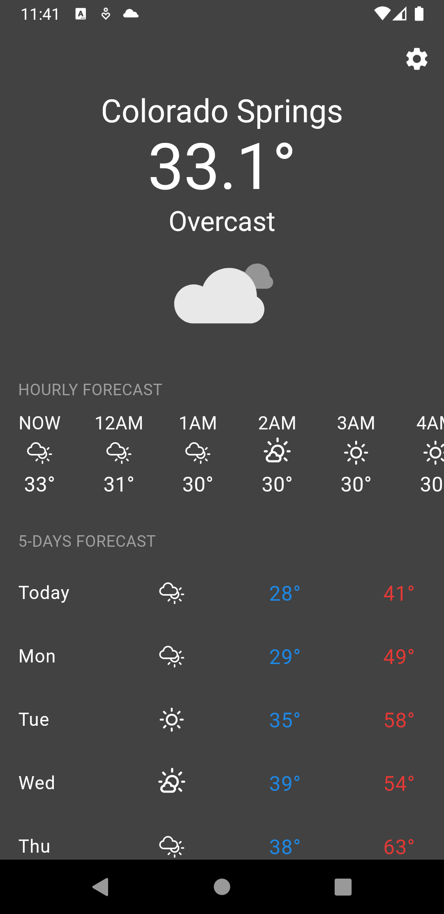
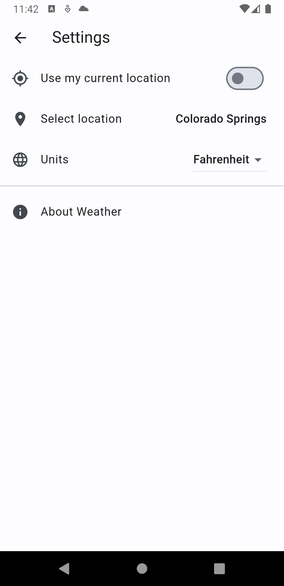
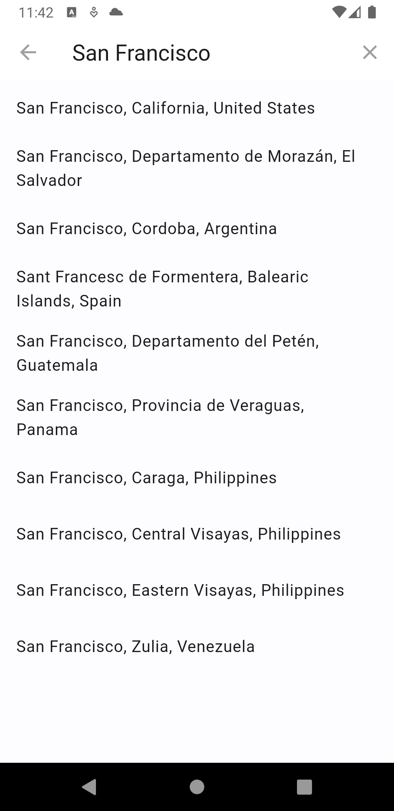

# Weather app

A weather app made in Flutter using Open Meteo (<https://open-meteo.com/>) API.

## Getting Started

### Preview

| Home | Settings | Location search
:--------------:|:-------------:|:-------------:
 |  | 

### Android APK

Just copy and install the [weather-app-release.apk](weather-app-release.apk) on your Android device.

## Features

- App changes theme (dark/light) according to night/day.
- Detects current user location and gets weather data (Open Meteo Weather Forecast API)
- Show current temperature and condition
- Shows hourly temperatures and conditions for the next 24h
- Shows 5-day forecast with max and min temperatures and conditions
- Allows search for a specific location (uses Open Meteo Geocoding API)
- Saves user selections (in SharedPreferences) for current location and units
- Uses beautiful Lottie animations to show current weather conditions

### Debug run

Run:

```sh
$ flutter run
```

And select your device or emulator.

## More info

- Carlos E. Torres (<cetorres@cetorres.com>)
