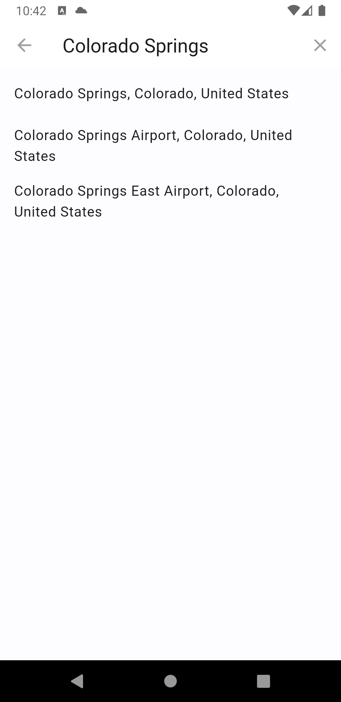

# Weather app

A weather app made in Flutter using Open Meteo (<https://open-meteo.com/>) API.

## Getting Started

### Preview

| Home | Settings | Location search
:--------------:|:-------------:|:-------------:
 |  | 

### Android APK

Just copy and install the [weather-app-release.apk](weather-app-release.apk) on your Android device.

### Debug run

Run:

```sh
$ flutter run
```

And select your device or emulator.

## More info

- Carlos E. Torres (<cetorres@cetorres.com>)
